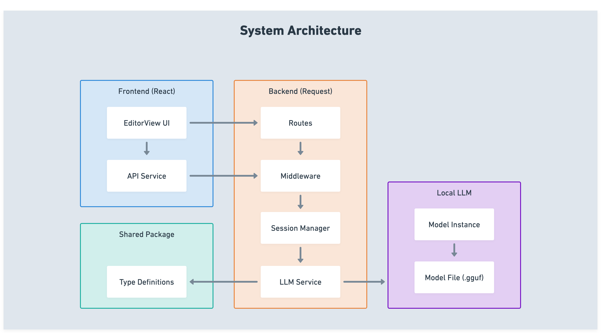

# AI Product From Scratch

**Goal:** Understanding, not production.

This repository teaches AI product development by building a real Communication Mirror agent - a tool that analyzes the emotional impact of messages. You'll learn:

- How to structure multi-step AI reasoning
- Prompt engineering that actually works
- Local LLM integration with node-llama-cpp
- Building without frameworks (so you understand what's happening)

**Not included:** Production concerns, scalability, frameworks, deployment

**What you get:** Deep understanding of how AI agents work under the hood

## Project Screenshots


*The Communication Mirror interface showing message analysis with intent, tone, impact, and alternative phrasings.*


*The application during requesting the large language model, loading state.*


*The logs interface showing LLM requests, responses, and validation details for debugging.*

## Learning Path Overview

This repository includes 10 comprehensive lessons that guide you through building an AI product from scratch. Follow them sequentially to build a complete understanding:

| Lesson | Title | What You'll Learn |
|--------|-------|-------------------|
| [01](lessons/01-introduction.md) | What is an AI Product and Why This Project? | Understand what makes AI products different, the project's goals, and what's included/excluded |
| [02](lessons/02-local-llm-basics.md) | Understanding Local LLMs and GGUF Models | Learn about local LLMs, GGUF format, quantization, and how to load models with node-llama-cpp |
| [03](lessons/03-prompt-engineering.md) | How to Write Effective Prompts | Master prompt engineering with calibration rules, error handling, and techniques that actually work |
| [04](lessons/04-structured-output.md) | JSON Schemas and Grammar Constraints | Enforce structured output using JSON schema grammars and validation layers |
| [05](lessons/05-multi-step-reasoning.md) | Breaking Complex Tasks into Steps | Decompose complex AI tasks into parallel analysis steps for efficient execution |
| [06](lessons/06-api-design.md) | Building REST APIs for AI Services | Design REST APIs that expose AI capabilities with proper error handling and middleware |
| [07](lessons/07-frontend-integration.md) | Connecting UI to AI Backend | Build a React frontend that consumes AI APIs with proper state management |
| [08](lessons/08-session-management.md) | Managing Conversation Context | Maintain conversation context across interactions for context-aware analysis |
| [09](lessons/09-validation-error-handling.md) | Ensuring Quality Outputs | Validate LLM outputs, handle errors gracefully, and implement retry logic |
| [10](lessons/10-trade-offs-lessons.md) | What We Learned and What We Skipped | Reflect on design decisions, trade-offs, and what would be different in production |

**Start with [Lesson 01](lessons/01-introduction.md) to begin your learning journey.**



## Prerequisites

Before getting started, ensure you have:

- **Node.js** >= 18.0.0 (check with `node --version`)
- **npm** (comes with Node.js)
- **TypeScript** knowledge: Basic understanding of types, interfaces, and async/await
- **React** knowledge: Familiarity with components, hooks, and JSX (for frontend)
- **Prompt** you heard of prompts 
- **System Requirements:**
  - **RAM**: 
    - Minimum: 4GB (for 1.7B Q4_K_M model)
    - Recommended: 8GB (for 4B Q6_K model)
    - Best: 12GB+ (for 8B Q6_K model)
  - **Disk Space**: 2-5GB for GGUF model files (depending on model size)
  - **OS**: macOS, Linux, or Windows (WSL recommended for Windows)
  - **GPU**: Optional (CPU-only works fine, GPU can speed up inference)

## Getting Started

### 1. Install Dependencies

```bash
npm install
```

This installs dependencies for all workspaces (backend, frontend, shared).

### 2. Download a GGUF Model

The project uses local LLMs in **GGUF format** (not PyTorch, not safetensors). You need to download a compatible model file.

#### Which Models Work?

**✅ Tested and Recommended:**
- **Qwen3-1.7B-Q8_0** (~2GB file, ~2GB RAM) - **Best for beginners**
- **Qwen3-4B-Instruct-2507-Q6_K** (~3GB file, ~3GB RAM) - **Best balance**
- **Qwen3-8B-Q6_K** (~5GB file, ~5GB RAM) - **Best quality**

**✅ Other Compatible Models:**
- Any **Qwen3** model in GGUF format
- Any **Llama 3** model in GGUF format
- Any **Mistral** model in GGUF format
- Any model compatible with `node-llama-cpp` (must be GGUF format)

**❌ Models That Won't Work:**
- PyTorch models (`.bin`, `.pth`, `.pt`)
- Safetensors models (`.safetensors`)
- ONNX models (`.onnx`)
- Models not in GGUF format

#### Understanding Quantization Levels

Quantization reduces model size and RAM usage by using fewer bits per weight. Here's what the codes mean:

| Quantization | Quality | File Size | RAM Usage | Speed | Best For |
|--------------|---------|-----------|-----------|-------|----------|
| **Q8_0** | Highest | Largest | Highest | Fastest | Best quality, 8GB+ RAM |
| **Q6_K** | High | Medium | Medium | Fast | **Recommended** - good balance |
| **Q5_K_M** | Good | Medium | Medium | Fast | Good balance |
| **Q4_K_M** | Fair | Small | Low | Medium | Limited RAM (4-6GB) |
| **Q3_K_M** | Lower | Smaller | Lower | Slower | Very limited RAM |
| **Q2_K** | Lowest | Smallest | Lowest | Slowest | Minimal RAM only |

**Recommendation:** Start with **Q6_K** or **Q8_0** for best results. Use **Q4_K_M** only if you have limited RAM.

#### System Requirements by Model Size

| Model Size | Minimum RAM | Recommended RAM | Disk Space | Inference Speed* |
|------------|-------------|-----------------|------------|------------------|
| **1.7B** (Q8_0) | 4GB | 6GB | 2GB | ~2-3 sec/analysis |
| **1.7B** (Q6_K) | 3GB | 5GB | 1.5GB | ~2-3 sec/analysis |
| **4B** (Q6_K) | 6GB | 8GB | 3GB | ~3-5 sec/analysis |
| **8B** (Q6_K) | 8GB | 12GB | 5GB | ~5-8 sec/analysis |

*Speed varies by CPU, RAM speed, and model quantization

**VRAM (GPU) Requirements:**
- **CPU-only (default):** Uses system RAM, no GPU needed
- **GPU acceleration:** Optional, requires CUDA/ROCm compatible GPU
- **To enable GPU:** Set `gpuLayers` in [`backend/lib/llm-service.ts`](backend/lib/llm-service.ts) (advanced, not required)

#### Where to Download Models

**Option 1: Hugging Face (Recommended)**
1. Go to [Hugging Face Models](https://huggingface.co/models?search=qwen3+gguf)
2. Search for "Qwen3" and filter by "GGUF"
3. Look for models from **TheBloke** (most reliable quantizations)
4. Download the `.gguf` file (not the entire repository)

**Option 2: TheBloke's Models (Easiest)**
1. Go to [TheBloke's Qwen3 Models](https://huggingface.co/TheBloke)
2. Search for "Qwen3"
3. Click on a model (e.g., "Qwen3-1.7B-Instruct-GGUF")
4. Download the `.gguf` file from "Files and versions" tab
5. Choose quantization level (Q8_0, Q6_K, Q4_K_M, etc.)

**Direct Download Links:**
- [Qwen3 1.7B (small model)](https://huggingface.co/Qwen/Qwen3-1.7B-GGUF/resolve/main/Qwen3-1.7B-Q8_0.gguf)
- [Qwen3 4B (small model)](https://huggingface.co/unsloth/Qwen3-4B-Instruct-2507-GGUF/resolve/main/Qwen3-4B-Instruct-2507-Q6_K.gguf)
- [Qwen3 8B (mid model)](https://huggingface.co/Qwen/Qwen3-8B-GGUF/resolve/main/Qwen3-8B-Q6_K.gguf)

#### How to Download

**Using Browser:**
1. Click the download link above
2. Wait for download to complete (may take several minutes for large files)
3. Move the `.gguf` file to `backend/models/` directory

**Using Command Line (Linux/macOS):**
```bash
# Create models directory
mkdir -p backend/models

# Download Qwen3-1.7B Q6_K (recommended)
cd backend/models
wget https://huggingface.co/TheBloke/Qwen3-1.7B-Instruct-GGUF/resolve/main/qwen3-1.7b-instruct.Q6_K.gguf

# Or using curl
curl -L -o qwen3-1.7b-instruct.Q6_K.gguf \
  https://huggingface.co/TheBloke/Qwen3-1.7B-Instruct-GGUF/resolve/main/qwen3-1.7b-instruct.Q6_K.gguf
```

**Verify Download:**
```bash
# Check file exists and size
ls -lh backend/models/*.gguf

# Should show file size matching expected (e.g., ~1.5GB for Q6_K 1.7B model)
```

### 3. Configure Environment Variables

Create a `.env` file in the `backend/` directory (optional - defaults are provided):

```bash
# backend/.env
MODEL_PATH=./models/qwen3-1.7b-instruct.Q6_K.gguf  # Path to your GGUF model file
```

**Important Notes:**
- The `MODEL_PATH` should match the **exact filename** you downloaded
- File names may vary (e.g., `qwen3-1.7b-instruct.Q6_K.gguf` vs `Qwen3-1.7B-Q6_K.gguf`)
- Use the actual filename from your download, not the example above
- If `MODEL_PATH` is not set, it defaults to `./models/model.gguf` (which won't exist unless you rename your file)

### 4. Run the Project

**Option A: Run both backend and frontend together:**
```bash
npm run dev
```

**Option B: Run separately:**
```bash
# Terminal 1: Backend
cd backend
npm run dev

# Terminal 2: Frontend
cd frontend
npm run dev
```

### 5. Access the Application

- **Frontend**: http://localhost:5173 (Vite default port)
- **Backend API**: http://localhost:3001
- **API Documentation**: http://localhost:3001/api-docs
- **Status Endpoint**: http://localhost:3001/api/status (check model loading progress)

**Note:** The model loads in the background. Wait for it to finish loading before making analysis requests. Check the status endpoint to see loading progress.

## Model Selection Quick Reference

**Not sure which model to choose?** Use this guide:

| Your RAM | Recommended Model | Download Link |
|----------|-------------------|---------------|
| 4-6GB | Qwen3-1.7B Q4_K_M | [Download Q4_K_M](https://huggingface.co/TheBloke/Qwen3-1.7B-Instruct-GGUF) |
| 6-8GB | Qwen3-1.7B Q6_K | [Download Q6_K](https://huggingface.co/TheBloke/Qwen3-1.7B-Instruct-GGUF) |
| 8GB+ | Qwen3-4B Q6_K | [Download 4B Q6_K](https://huggingface.co/TheBloke/Qwen3-4B-Instruct-GGUF) |
| 12GB+ | Qwen3-8B Q6_K | [Download 8B Q6_K](https://huggingface.co/TheBloke/Qwen3-8B-Instruct-GGUF) |

**First time?** Start with **Qwen3-1.7B Q6_K** - it's a good balance of quality and resource usage.

## Troubleshooting

For detailed troubleshooting help, see **[TROUBLESHOOTING.md](./TROUBLESHOOTING.md)**.

**Quick fixes:**
- **Model not loading?** Verify `MODEL_PATH` points to a valid `.gguf` file
- **Out of memory?** Try a smaller quantized model (Q8_0 or Q6_K instead of Q4_K_M)
- **Port already in use?** Change `PORT` in `.env` or kill the process using that port
- **Dependencies issues?** Run `npm run clean && npm install` to reinstall everything
- **Validation errors?** Check `/api/logs` endpoint or `backend/logs/` directory for LLM output
- **Model still loading?** Check `/api/status` endpoint to see loading progress
